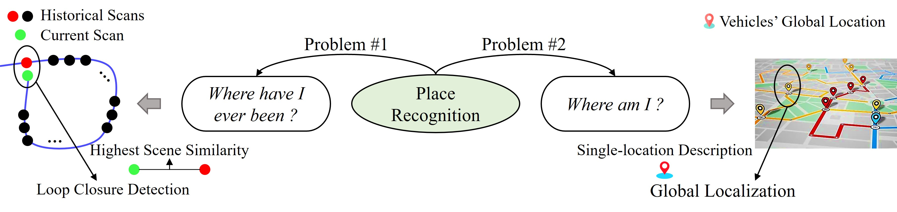
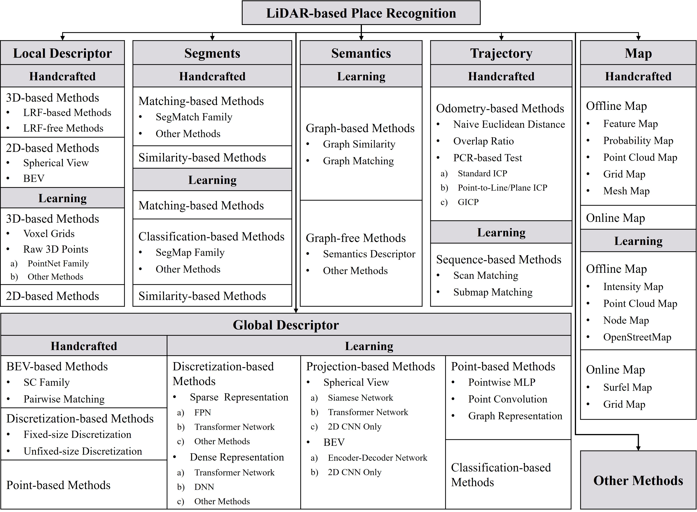

<h1 align="center">LiDAR-based Place Recognition For Autonomous Driving: A Survey</h1>

<div align="center">

Yongjun Zhang (张永军), [Pengcheng Shi* (史鹏程)](https://shipc-ai.github.io), Jiayuan Li* (李加元)

<p style="font-size: 16px; font-family: 'Arial', sans-serif; color: #888;">Our <a href="https://dl.acm.org/doi/10.1145/3707446" style="color: #4A90E2; text-decoration: none;">[Paper]</a> has been published on <strong>ACM Computing Surveys</strong> (Impact Factor: 23.8), *: Corresponding author </p> 
</div>

LiDAR has gained popularity in autonomous driving due to advantages like long measurement distance, rich three-dimensional information, and stability in harsh environments. **Place Recognition (PR)** enables vehicles to identify previously visited locations despite variations in appearance, weather, and viewpoints, even determining their global location within prior maps. This capability is crucial for accurate localization in autonomous driving. Consequently, **LiDAR-based Place Recognition (LPR)** has emerged as a research hotspot in robotics. However, existing reviews predominantly concentrate on Visual Place Recognition, leaving a gap in systematic reviews on **LPR**. This article bridges this gap by providing a comprehensive review of **LPR** methods, thus facilitating and encouraging further research. We commence by exploring the relationship between PR and autonomous driving components. Then, we delve into the problem formulation of **LPR**, challenges, and relations to previous surveys. Subsequently, we conduct an in-depth review of related research, which offers detailed classifications, strengths and weaknesses, and architectures. Finally, we summarize existing datasets and evaluation metrics and envision promising future directions. This article can serve as a valuable tutorial for newcomers entering the field of place recognition.

### News
- **2024.11:** Our has been accepted for ***ACM Computing Surveys***
- **2024.12:** The published paper is available: [Published Paper](https://dl.acm.org/doi/10.1145/3707446)
- **2025.02:** We upload the figures and pdf

### Citation
If you think this work is useful for your research, please cite our paper:
```
@article{zhang2024lidar,
  title={Lidar-based place recognition for autonomous driving: A survey},
  author={Zhang, Yongjun and Shi, Pengcheng and Li, Jiayuan},
  journal={ACM Computing Surveys},
  volume={57},
  number={4},
  pages={1--36},
  year={2024},
  publisher={ACM New York, NY}
}
```
### Two Key Problems Addressed by PR
- **Question 1**: It addresses the problem of "**<span style="color:red">where have I ever been</span>**, " also known as **Loop Closure Detection (LCD)**. In this context, **PR** and localization are interdependent, with PR enhancing localization accuracy through loop closure detection 
- **Question 2**: It tackles the issue of "**<span style="color:red">where am I</span>**," also known as global localization. In this context, **PR** is a specialized localization method that directly provides the vehicle’s global pose.


### Taxonomy of Methods
We categorize methods into handcrafted and learning-based types, further subdividing them, and present detailed introductions to pioneering works. 


### Methods Organized by Year
[website_handcrafted]: https://img.shields.io/badge/Handcrafted-blue
[website_learning]: https://img.shields.io/badge/Learning-green
[website_paper]: https://img.shields.io/badge/Paper-gray
[website_git]: https://badges.aleen42.com/src/github.svg
#### 2024
- SGLC: Semantic Graph-Guided Coarse-Fine-Refine Full Loop Closing for LiDAR SLAM | ``arXiv``
![Learning Badge][website_learning] [![Paper Badge][website_paper]](https://arxiv.org/abs/2407.08106) [![GitHub][website_git]](https://github.com/nubot-nudt/SGLC)

- CrossLoc3D: Aerial-Ground Cross-Source 3D Place Recognition | ``ICCV``
![Learning Badge][website_learning] [![Paper Badge][website_paper]](https://openaccess.thecvf.com/content/ICCV2023/html/Guan_CrossLoc3D_Aerial-Ground_Cross-Source_3D_Place_Recognition_ICCV_2023_paper.html) [![GitHub][website_git]](https://github.com/rayguan97/crossloc3d)

- BTC: A Binary and Triangle Combined Descriptor for 3-D Place Recognition | ``TRO``
![Handcrafted Badge][website_handcrafted] [![Paper Badge][website_paper]](https://ieeexplore.ieee.org/abstract/document/10388464) [![GitHub][website_git]](https://github.com/hku-mars/btc_descriptor)

- A New Horizon: Employing Map Clustering Similarity for LiDAR-based Place Recognition | ``TIV``
![Handcrafted Badge][website_handcrafted] [![Paper Badge][website_paper]](https://ieeexplore.ieee.org/abstract/document/10416737) [![GitHub][website_git]](https://github.com/ShiPC-AI/MCS)

- Fast and Accurate Deep Loop Closing and Relocalization for Reliable LiDAR SLAM | ``TRO``
![Learning Badge][website_learning] [![Paper Badge][website_paper]](https://ieeexplore.ieee.org/abstract/document/10494918) [![GitHub][website_git]](https://github.com/nubot-nudt/LCR-Net)

- P-GAT: Pose-Graph Attentional Network for Lidar Place Recognition | ``RAL``
![Learning Badge][website_learning] [![Paper Badge][website_paper]](https://ieeexplore.ieee.org/abstract/document/10354406) [![GitHub][website_git]](https://github.com/csiro-robotics/P-GAT)

- Effectively Detecting Loop Closures using Point Cloud Density Maps | ``ICRA``
![Handcrafted Badge][website_handcrafted] [![Paper Badge][website_paper]](https://www.ipb.uni-bonn.de/pdfs/gupta2024icra.pdf)  [![GitHub][website_git]](https://github.com/PRBonn/MapClosures)

- OverlapMamba: Novel Shift State Space Model for LiDAR-based Place Recognition | ``arXiv``
![Learning Badge][website_learning] [![Paper Badge][website_paper]](https://arxiv.org/abs/2405.07966) [![GitHub][website_git]](https://github.com/SCNU-RISLAB/OverlapMamba)

- OSK: A Novel LiDAR Occupancy Set Key-Based Place Recognition Method in Urban Environment | ``TIM``
![Handcrafted Badge][website_handcrafted] [![Paper Badge][website_paper]](https://ieeexplore.ieee.org/abstract/document/10464375) [![GitHub][website_git]](https://github.com/ZhangZh3ng/Occupancy-Set-Key)

- SelFLoc: Selective feature fusion for large-scale point cloud-based place recognition
| ``KBS``
![Learning Badge][website_learning] [![Paper Badge][website_paper]](https://www.sciencedirect.com/science/article/abs/pii/S0950705124004283)

- CVTNet: A Cross-View Transformer Network for LiDAR-Based Place Recognition in Autonomous Driving Environments | ``TII``
![Learning Badge][website_learning] [![Paper Badge][website_paper]](https://ieeexplore.ieee.org/abstract/document/10273716) [![GitHub][website_git]](https://github.com/BIT-MJY/CVTNet)

- Uncertainty-Aware Lidar Place Recognition in Novel Environments | ``IROS``
![Learning Badge][website_learning] [![Paper Badge][website_paper]](https://ieeexplore.ieee.org/abstract/document/10341383) [![GitHub][website_git]](https://github.com/csiro-robotics/Uncertainty-LPR)

#### 2023
- CCL: Continual Contrastive Learning for LiDAR Place Recognition | ``RAL``
![Learning Badge][website_learning] [![Paper Badge][website_paper]](https://ieeexplore.ieee.org/abstract/document/10146414) [![GitHub][website_git]](https://github.com/cloudcjf/CCL)

- BioSLAM: A Bioinspired Lifelong Memory System for General Place Recognition | ``TRO``
![Learning Badge][website_learning] [![Paper Badge][website_paper]](https://ieeexplore.ieee.org/abstract/document/10242249)  [![GitHub][website_git]](https://github.com/MetaSLAM/AutoMemory_Docker)

- CASSPR: Cross Attention Single Scan Place Recognition | ``ICCV``
![Learning Badge][website_learning] [![Paper Badge][website_paper]](https://openaccess.thecvf.com/content/ICCV2023/html/Xia_CASSPR_Cross_Attention_Single_Scan_Place_Recognition_ICCV_2023_paper.html) [![GitHub][website_git]](https://github.com/Yan-Xia/CASSPR)

- Contour Context: Abstract Structural Distribution for 3D LiDAR Loop Detection and Metric Pose Estimation | ``ICRA``
![Handcrafted Badge][website_handcrafted] [![Paper Badge][website_paper]](https://ieeexplore.ieee.org/abstract/document/10160337) [![GitHub][website_git]](https://github.com/lewisjiang/contour-context)

- BEVPlace: Learning LiDAR-based Place Recognition using Bird's Eye View Images | ``ICCV``
![Learning Badge][website_learning] [![Paper Badge][website_paper]](https://openaccess.thecvf.com/content/ICCV2023/html/Luo_BEVPlace_Learning_LiDAR-based_Place_Recognition_using_Birds_Eye_View_Images_ICCV_2023_paper.html) [![GitHub][website_git]](https://github.com/zjuluolun/BEVPlace)

- Uncertainty-Aware Lidar Place Recognition in Novel Environments | ``IROS``
![Learning Badge][website_learning] [![Paper Badge][website_paper]](https://ieeexplore.ieee.org/abstract/document/10341383) [![GitHub][website_git]](https://github.com/csiro-robotics/Uncertainty-LPR)

- TReR: A Lightweight Transformer Re-Ranking Approach for 3D LiDAR Place Recognition | ``ITSC``
![Learning Badge][website_learning] [![Paper Badge][website_paper]](https://ieeexplore.ieee.org/abstract/document/10421819)

- STD: Stable Triangle Descriptor for 3D place recognition | ``ICRA``
![Handcrafted Badge][website_handcrafted] [![Paper Badge][website_paper]](https://ieeexplore.ieee.org/abstract/document/10160413) [![GitHub][website_git]](https://github.com/hku-mars/STD)

- Place Recognition of Large-Scale Unstructured Orchards With Attention Score Maps | ``RAL``
![Handcrafted Badge][website_handcrafted] [![Paper Badge][website_paper]](https://ieeexplore.ieee.org/document/10008029)

- VNI-Net: Vector Neurons-based Rotation-Invariant Descriptor for LiDAR Place Recognition | ``arXiv``
![Learning Badge][website_learning] [![Paper Badge][website_paper]](https://arxiv.org/pdf/2308.12870) [![GitHub][website_git]](https://github.com/tiev-tongji/VNI-Net)

- A fast LiDAR place recognition and localization method by fusing local and global search | ``ISPRSJ``
![Handcrafted Badge][website_handcrafted] [![Paper Badge][website_paper]](https://www.sciencedirect.com/science/article/abs/pii/S0924271623001892) [![GitHub][website_git]](https://github.com/ShiPC-AI/Occupied-Place-Description)

- RING++: Roto-Translation Invariant Gram for Global Localization on a Sparse Scan Map | ``TRO``
![Handcrafted Badge][website_handcrafted] [![Paper Badge][website_paper]](https://ieeexplore.ieee.org/document/10224330) [![GitHub][website_git]](https://github.com/lus6-Jenny/RING)

- Place Recognition of Large-Scale Unstructured Orchards With Attention Score Maps | ``RAL``
![Handcrafted Badge][website_handcrafted] [![Paper Badge][website_paper]](https://ieeexplore.ieee.org/abstract/document/10008029)

- GeoAdapt: Self-Supervised Test-Time Adaptation in LiDAR Place Recognition Using Geometric Priors  | ``RAL``
![Learning Badge][website_learning] [![Paper Badge][website_paper]](https://ieeexplore.ieee.org/abstract/document/10333332)

- ORCHNet: A Robust Global Feature Aggregation approach for 3D LiDAR-based Place recognition in Orchards | ``arXiv``
![Learning Badge][website_learning] [![Paper Badge][website_paper]](https://arxiv.org/abs/2303.00477) [![Paper Badge][website_paper]](https://github.com/Cybonic/ORCHNet)

- OverlapNetVLAD: A Coarse-to-Fine Framework for LiDAR-based Place Recognition | ``arXiv``
![Learning Badge][website_learning] [![Paper Badge][website_paper]](https://arxiv.org/abs/2303.06881) [![Paper Badge][website_paper]](https://github.com/fcchit/OverlapNetVLAD)

- Binary Image Fingerprint: Stable Structure Identifier for 3D LiDAR Place Recognition ``RAL``
![Handcrafted Badge][website_handcrafted] [![Paper Badge][website_paper]](https://ieeexplore.ieee.org/abstract/document/10187686)  [![GitHub][website_git]](https://github.com/zhongbusishaonianyou/Image_fingerprint)

- Spherical Transformer for LiDAR-Based 3D Recognition | ``CVPR``
![Learning Badge][website_learning] [![Paper Badge][website_paper]](https://openaccess.thecvf.com/content/CVPR2023/html/Lai_Spherical_Transformer_for_LiDAR-Based_3D_Recognition_CVPR_2023_paper.html) [![GitHub][website_git]](https://github.com/dvlab-research/SphereFormer)

#### 2022
- SphereVLAD++: Attention-Based and Signal-Enhanced Viewpoint Invariant Descriptor | ``RAL`` 
![Learning Badge][website_learning] [![Paper Badge][website_paper]](https://ieeexplore.ieee.org/abstract/document/9956017) [![GitHub][website_git]](https://github.com/MetaSLAM/SphereVLAD)

- SVT-Net: Super Light-Weight Sparse Voxel Transformer for Large Scale Place Recognition | ``AAAI``
![Learning Badge][website_learning] [![Paper Badge][website_paper]](https://ojs.aaai.org/index.php/AAAI/article/view/19934) [![GitHub][website_git]](https://github.com/ZhenboSong/SVTNet)

- BoxGraph: Semantic Place Recognition and Pose Estimation from 3D LiDAR | ``IROS``
![Learning Badge][website_learning] [![Paper Badge][website_paper]](https://ieeexplore.ieee.org/abstract/document/9981266)

- RINet: Efficient 3D Lidar-Based Place Recognition Using Rotation Invariant Neural Network | ``RAL``
![Learning Badge][website_learning] [![Paper Badge][website_paper]](https://ieeexplore.ieee.org/abstract/document/9712221) [![GitHub][website_git]](https://github.com/lilin-hitcrt/RINet)

- Efficient 3D Point Cloud Feature Learning for Large-Scale Place Recognition | ``TIP``
![Learning Badge][website_learning] [![Paper Badge][website_paper]](https://ieeexplore.ieee.org/abstract/document/9668913) [![GitHub][website_git]](https://github.com/fpthink/EPC-Net)

- AttDLNet: Attention-Based Deep Network for 3D LiDAR Place Recognition | ``ROBOT``
![Learning Badge][website_learning] [![Paper Badge][website_paper]](https://link.springer.com/chapter/10.1007/978-3-031-21065-5_26#citeas) [![GitHub][website_git]](https://github.com/Cybonic/AttDLNet)

- OverlapTransformer: An Efficient and Yaw-Angle-Invariant Transformer Network for LiDAR-Based Place Recognition | ``RAL``
![Learning Badge][website_learning] [![Paper Badge][website_paper]](https://ieeexplore.ieee.org/abstract/document/9785497) [![GitHub][website_git]](https://github.com/haomo-ai/OverlapTransformer) 

- SeqOT: A Spatial–Temporal Transformer Network for Place Recognition Using Sequential LiDAR Data | ``TIE``
![Learning Badge][website_learning] [![Paper Badge][website_paper]](https://ieeexplore.ieee.org/abstract/document/9994714) [![GitHub][website_git]](https://github.com/BIT-MJY/SeqOT)

- Simultaneous viewpoint-and condition-invariant loop closure detection based on LiDAR descriptor for outdoor large-scale environments | ``TIE``
![Learning Badge][website_learning] [![Paper Badge][website_paper]](https://ieeexplore.ieee.org/abstract/document/9749963)

- HiTPR: Hierarchical Transformer for Place Recognition in Point Cloud | ``ICRA``
![Learning Badge][website_learning] [![Paper Badge][website_paper]](https://ieeexplore.ieee.org/abstract/document/9811737)
 
- LoGG3D-Net: Locally Guided Global Descriptor Learning for 3D Place Recognition | ``ICRA``
![Learning Badge][website_learning] [![Paper Badge][website_paper]](https://ieeexplore.ieee.org/abstract/document/9811753) [![GitHub][website_git]](https://github.com/csiro-robotics/LoGG3D-Net)

- MinkLoc3D-SI: 3D LiDAR Place Recognition With Sparse Convolutions, Spherical Coordinates, and Intensity | ``RAL``
![Learning Badge][website_learning] [![Paper Badge][website_paper]](https://ieeexplore.ieee.org/abstract/document/9661423) [![GitHub][website_git]](https://github.com/KamilZywanowski/MinkLoc3D-SI)

- Improving Point Cloud Based Place Recognition with Ranking-based Loss and Large Batch Training | ``ICPR``
![Learning Badge][website_learning] [![Paper Badge][website_paper]](https://ieeexplore.ieee.org/abstract/document/9956458) [![GitHub][website_git]](https://github.com/jac99/MinkLoc3Dv2)
- LCDNet: Deep Loop Closure Detection and Point Cloud Registration for LiDAR SLAM | ``TRO``
![Learning Badge][website_learning] [![Paper Badge][website_paper]](https://ieeexplore.ieee.org/abstract/document/9723505) [![GitHub][website_git]](https://github.com/robot-learning-freiburg/LCDNet) 

- One RING to Rule Them All: Radon Sinogram for Place Recognition, Orientation and Translation Estimation: | ``IROS``
![Handcrafted Badge][website_handcrafted] [![Paper Badge][website_paper]](https://ieeexplore.ieee.org/document/9981308)

- Fresco: Frequency-domain scan context for lidar-based place recognition with translation and rotation invariance: | ``ICARCV``
![Handcrafted Badge][website_handcrafted] [![Paper Badge][website_paper]](https://ieeexplore.ieee.org/document/10004331) [![GitHub][website_git]](https://github.com/soytony/FreSCo)

- High Accuracy and Low Complexity Lidar Place Recognition Using Unitary Invariant Frobenius Norm: | ``IEEE Sensors``
![Handcrafted Badge][website_handcrafted] [![Paper Badge][website_paper]](https://ieeexplore.ieee.org/abstract/document/9955556)

- AdaFusion: Visual-LiDAR Fusion With Adaptive Weights for Place Recognition | ``RAL``
![Learning Badge][website_learning] [![Paper Badge][website_paper]](https://ieeexplore.ieee.org/abstract/document/9905898) [![GitHub][website_git]](https://github.com/MetaSLAM/AdaFusion)

- InCloud: Incremental Learning for Point Cloud Place Recognition | ``IROS``
![Learning Badge][website_learning] [![Paper Badge][website_paper]](https://ieeexplore.ieee.org/abstract/document/9981252) [![GitHub][website_git]](https://github.com/csiro-robotics/InCloud)

- A heterogeneous 3D map-based place recognition solution using virtual LiDAR and a polar grid height coding image descriptor | ``ISPRSJ``
![Handcrafted Badge][website_handcrafted] [![Paper Badge][website_paper]](https://www.sciencedirect.com/science/article/abs/pii/S0924271621002884) [![GitHub][website_git]](https://github.com/Dongxu05/CSSC)

- Dh3d: Deep hierarchical 3d descriptors for robust large-scale 6dof relocal-
ization | ``ECCV``
![Learning Badge][website_learning] [![Paper Badge][website_paper]](https://link.springer.com/chapter/10.1007/978-3-030-58548-8_43) [![GitHub][website_git]](https://github.com/JuanDuGit/DH3D)

- DSC: Deep Scan Context Descriptor for Large-Scale Place Recognition | ``MFI``
![Learning Badge][website_learning] [![Paper Badge][website_paper]](https://ieeexplore.ieee.org/abstract/document/9913850)

- Object Scan Context: Object-centric Spatial Descriptor for Place Recognition within 3D Point Cloud Map | ``arXiv``
![Learning Badge][website_learning] [![Paper Badge][website_paper]](https://arxiv.org/abs/2206.03062) 

- SC-LPR: Spatiotemporal context based LiDAR place recognition | ``PRL``
![Learning Badge][website_learning] [![Paper Badge][website_paper]](https://www.sciencedirect.com/science/article/abs/pii/S0167865522000782) [![GitHub][website_git]](https://github.com/Daideyun/SC-LPR)

- Retriever: Point Cloud Retrieval in Compressed 3D Maps | ``ICRA``
![Learning Badge][website_learning] [![Paper Badge][website_paper]](https://ieeexplore.ieee.org/abstract/document/9811785) [![GitHub][website_git]](https://github.com/PRBonn/retriever)

- Place recognition and navigation of outdoor mobile robots based on random Forest learning with a 3D LiDAR  ``Journal of Intelligent & Robotic Systems``
![Learning Badge][website_learning] [![Paper Badge][website_paper]](https://link.springer.com/article/10.1007/s10846-021-01545-5)

#### 2021
- NDT-Transformer: Large-Scale 3D Point Cloud Localisation using the Normal Distribution Transform Representation |``ICRA``
![Learning Badge][website_learning] [![Paper Badge][website_paper]](https://ieeexplore.ieee.org/abstract/document/9560932) [![GitHub][website_git]](https://github.com/dachengxiaocheng/NDT-Transformer)

- MinkLoc3D: Point Cloud Based Large-Scale Place Recognition |``WACV``
![Learning Badge][website_learning] [![Paper Badge][website_paper]](https://openaccess.thecvf.com/content/WACV2021/html/Komorowski_MinkLoc3D_Point_Cloud_Based_Large-Scale_Place_Recognition_WACV_2021_paper.html) [![GitHub][website_git]](https://github.com/jac99/MinkLoc3D)   

- MinkLoc++: Lidar and Monocular Image Fusion for Place Recognition | ``IJCNN``
![Learning Badge][website_learning] [![Paper Badge][website_paper]](https://ieeexplore.ieee.org/abstract/document/9533373) [![GitHub][website_git]](https://github.com/jac99/MinkLocMultimodal)

- EgoNN: Egocentric Neural Network for Point Cloud Based 6DoF Relocalization at the City Scale | ``RAL``
![Learning Badge][website_learning] [![Paper Badge][website_paper]](https://ieeexplore.ieee.org/abstract/document/9645340) [![GitHub][website_git]](https://github.com/jac99/Egonn)

- TransLoc3D : Point Cloud based Large-scale Place Recognition using Adaptive Receptive Fields | ``arXiv``
![Learning Badge][website_learning] [![Paper Badge][website_paper]](https://arxiv.org/abs/2105.11605) [![GitHub][website_git]](https://github.com/slothfulxtx/TransLoc3D)

- Pyramid Point Cloud Transformer for Large-Scale Place Recognition | ``ICCV``
![Learning Badge][website_learning] [![Paper Badge][website_paper]](https://openaccess.thecvf.com/content/ICCV2021/html/Hui_Pyramid_Point_Cloud_Transformer_for_Large-Scale_Place_Recognition_ICCV_2021_paper.html?ref=https://githubhelp.com) [![GitHub][website_git]](https://github.com/fpthink/PPT-Net) 

- SSC: Semantic Scan Context for Large-Scale Place Recognition | ``IROS``
![Learning Badge][website_learning] [![Paper Badge][website_paper]](https://ieeexplore.ieee.org/abstract/document/9635904) [![GitHub][website_git]](https://github.com/lilin-hitcrt/SSC)

- A registration-aided domain adaptation network for 3d point cloud based place recognition | ``IROS``
![Learning Badge][website_learning] [![Paper Badge][website_paper]](https://ieeexplore.ieee.org/abstract/document/9635878)


- SOE-Net: A Self-Attention and Orientation Encoding Network for Point Cloud Based Place Recognition | ``CVPR``
![Learning Badge][website_learning] [![Paper Badge][website_paper]](https://openaccess.thecvf.com/content/CVPR2021/html/Xia_SOE-Net_A_Self-Attention_and_Orientation_Encoding_Network_for_Point_Cloud_CVPR_2021_paper.html) [![GitHub][website_git]](https://github.com/Yan-Xia/SOE-Net) 

- Scan Context++: Structural Place Recognition Robust to Rotation and Lateral Variations in Urban Environments: | ``TRO`` 
![Handcrafted Badge][website_handcrafted] [![Paper Badge][website_paper]](https://ieeexplore.ieee.org/document/9610172) [![GitHub][website_git]](https://github.com/asdfghjkl623/scancontext) 

- Weighted scan context: Global descriptor with sparse height feature for loop closure detection: | ``ICCCR``
![Handcrafted Badge][website_handcrafted] [![Paper Badge][website_paper]](https://ieeexplore.ieee.org/document/9349417)

- Season-Invariant and Viewpoint-Tolerant LiDAR Place Recognition in GPS-Denied Environments | ``TIE``
![Handcrafted Badge][website_handcrafted] [![Paper Badge][website_paper]](https://ieeexplore.ieee.org/abstract/document/8948317)

- Spherical Multi-Modal Place Recognition for Heterogeneous Sensor Systems | ``ICRA``
![Learning Badge][website_learning] [![Paper Badge][website_paper]](https://ieeexplore.ieee.org/abstract/document/9561078)

- DiSCO: Differentiable Scan Context With Orientation | ``RAL``
![Learning Badge][website_learning] [![Paper Badge][website_paper]](https://ieeexplore.ieee.org/abstract/document/9359460) [![GitHub][website_git]](https://github.com/MaverickPeter/DiSCO-pytorch)

- CORAL: Colored structural representation for bi-modal place recognition | ``IROS``
![Learning Badge][website_learning] [![Paper Badge][website_paper]](https://ieeexplore.ieee.org/abstract/document/9635839) [![GitHub][website_git]](https://github.com/Panyiyuan96/CORAL_Pytorch)

- OverlapNet: a siamese network for computing LiDAR scan similarity with applications to loop closing and localization | ``Autonomous Robots``
![Learning Badge][website_learning] [![Paper Badge][website_paper]](https://link.springer.com/article/10.1007/s10514-021-09999-0) [![GitHub][website_git]](https://github.com/PRBonn/OverlapNet) 

- On the descriptive power of LiDAR intensity images for segment-based loop closing in 3-D SLAM | ``IROS``
![Learning Badge][website_learning] [![Paper Badge][website_paper]](https://ieeexplore.ieee.org/abstract/document/9636698)

- PSE-Match: A Viewpoint-Free Place Recognition Method With Parallel Semantic Embedding | ``TITS``
![Learning Badge][website_learning] [![Paper Badge][website_paper]](https://ieeexplore.ieee.org/abstract/document/9523568)

#### 2020
- Voxel-Based Representation Learning for Place Recognition Based on 3D Point Clouds | IROS
![Learning Badge][website_learning] [![Paper Badge][website_paper]](https://ieeexplore.ieee.org/abstract/document/9340992)

- SpoxelNet: Spherical Voxel-based Deep Place Recognition for 3D Point Clouds of Crowded Indoor Spaces | IROS
![Learning Badge][website_learning] [![Paper Badge][website_paper]](https://ieeexplore.ieee.org/abstract/document/9341549)

- SRNet: A 3D Scene Recognition Network using Static Graph and Dense Semantic Fusion | ``Computer Graphics Forum``
![Learning Badge][website_learning] [![Paper Badge][website_paper]](https://onlinelibrary.wiley.com/doi/abs/10.1111/cgf.14146?casa_token=h4SmA1LUVLsAAAAA%3AyB6TSiG79hX1Hbif_BgsTPj_Lc0Cp4zlLYaRLaVI9ix3G32whsjrLMWhJALVj1bDhpSxxm9gYYT62lk)

- LiDAR Iris for Loop-Closure Detection: | ``IROS``
![Handcrafted Badge][website_handcrafted] [![Paper Badge][website_paper]](https://ieeexplore.ieee.org/document/9341010) [![GitHub][website_git]](https://github.com/JoestarK/LiDAR-Iris) 

- Intensity Scan Context: Coding Intensity and Geometry Relations for Loop Closure Detection: | ``ICRA``
![Handcrafted Badge][website_handcrafted] [![Paper Badge][website_paper]](https://ieeexplore.ieee.org/document/9196764) [![GitHub][website_git]](https://github.com/wh200720041/iscloam) 

- PIC-Net: Point Cloud and Image Collaboration Network for Large-Scale Place Recognition | ``arXiv``
![Learning Badge][website_learning] [![Paper Badge][website_paper]](https://arxiv.org/abs/2008.00658)

- A Fast and Robust Place Recognition Approach for Stereo Visual Odometry Using LiDAR Descriptors | ``IROS``
![Handcrafted Badge][website_handcrafted] [![Paper Badge][website_paper]](https://ieeexplore.ieee.org/abstract/document/9341733) [![GitHub][website_git]](https://github.com/IRVLab/so_dso_place_recognition) 

- DAGC: Employing Dual Attention and Graph Convolution for Point Cloud based Place Recognition | ``ICMR``
![Learning Badge][website_learning] [![Paper Badge][website_paper]](https://dl.acm.org/doi/abs/10.1145/3372278.3390693)

- SegMap: Segment-based mapping and localization using data-driven descriptors | ``IJRR``
![Learning Badge][website_learning] [![Paper Badge][website_paper]](https://journals.sagepub.com/doi/full/10.1177/027836919863090?casa_token=ZBTvxr35_psAAAAA%3A04rGb0-zKcsSqpRwDQElNHtV5ghAXTVgWeVXU8VgCtHPBXwQfwAjh1y3Sn8zWSqU3TZ86t-agjQzEw) 

- Seed: A Segmentation-Based Egocentric 3D Point Cloud Descriptor for Loop Closure Detection | ``IROS``
![Handcrafted Badge][website_handcrafted] [![Paper Badge][website_paper]](https://ieeexplore.ieee.org/abstract/document/9341517) 

- Learning an Overlap-based Observation Model for 3D LiDAR Localization |``IROS``
![Learning Badge][website_learning] [![Paper Badge][website_paper]](https://ieeexplore.ieee.org/abstract/document/9340769) [![GitHub][website_git]](https://github.com/PRBonn/overlap_localization)

- LiPMatch: LiDAR Point Cloud Plane Based Loop-Closure |``RAL``
![Handcrafted Badge][website_handcrafted] [![Paper Badge][website_paper]](https://ieeexplore.ieee.org/abstract/document/9185044) [![GitHub][website_git]](https://github.com/ahandsomeperson/LiPMatch)

#### 2019
- OREOS: Oriented Recognition of 3D Point Clouds in Outdoor Scenarios | ``IROS``
![Learning Badge][website_learning] [![Paper Badge][website_paper]](https://ieeexplore.ieee.org/abstract/document/8968094)

- PCAN: 3D Attention Map Learning Using Contextual Information for Point Cloud Based Retrieval | ``CVPR``
![Learning Badge][website_learning] [![Paper Badge][website_paper]](https://openaccess.thecvf.com/content_CVPR_2019/html/Zhang_PCAN_3D_Attention_Map_Learning_Using_Contextual_Information_for_Point_CVPR_2019_paper.html) [![GitHub][website_git]](https://github.com/XLechter/PCAN)  

- LPD-Net: 3D Point Cloud Learning for Large-Scale Place Recognition and Environment Analysis | ``ICCV``
![Learning Badge][website_learning] [![Paper Badge][website_paper]](https://openaccess.thecvf.com/content_ICCV_2019/html/Liu_LPD-Net_3D_Point_Cloud_Learning_for_Large-Scale_Place_Recognition_and_ICCV_2019_paper.html) [![GitHub][website_git]](https://github.com/Suoivy/LPD-net) 

- Semantically Assisted Loop Closure in SLAM Using NDT Histograms | ``IROS``
![Learning Badge][website_learning] [![Paper Badge][website_paper]](https://ieeexplore.ieee.org/abstract/document/8968140) [![GitHub][website_git]](https://github.com/azaganidis/se_ndt)

- c-m2dp: A fast point cloud descriptor with color information to perform loop closure detection | ``CASE``
![Handcrafted Badge][website_handcrafted] [![Paper Badge][website_paper]](https://ieeexplore.ieee.org/document/8842896)

- 1-Day Learning, 1-Year Localization: Long-Term LiDAR Localization Using Scan Context Image | ``RAL``
![Learning Badge][website_learning] [![Paper Badge][website_paper]](https://ieeexplore.ieee.org/abstract/document/8633942) [![GitHub][website_git]](https://github.com/asdfghjkl623/scancontext) 

- SeqLPD: Sequence Matching Enhanced Loop-Closure Detection Based on Large-Scale Point Cloud Description for Self-Driving Vehicles | ``IROS``
![Learning Badge][website_learning] [![Paper Badge][website_paper]](https://ieeexplore.ieee.org/abstract/document/8967875)

- Loop Closure Detection in Closed Environments | ``ECMR``
![Handcrafted Badge][website_handcrafted] [![Paper Badge][website_paper]](https://ieeexplore.ieee.org/abstract/document/8870938)

#### 2018
- Scan Context: Egocentric Spatial Descriptor for Place Recognition Within 3D Point Cloud Map | ``IROS``
![Handcrafted Badge][website_handcrafted] [![Paper Badge][website_paper]](https://ieeexplore.ieee.org/document/8593953) [![GitHub][website_git]](https://github.com/gisbi-kim/scancontext) 

- PointNetVLAD: Deep Point Cloud Based Retrieval for Large-Scale Place Recognition | ``CVPR``
![Learning Badge][website_learning] [![Paper Badge][website_paper]](https://openaccess.thecvf.com/content_cvpr_2018/html/Uy_PointNetVLAD_Deep_Point_CVPR_2018_paper.html) [![GitHub][website_git]](https://github.com/mikacuy/pointnetvlad) 

- Delight: An Efficient Descriptor for Global Localisation Using LiDAR Intensities | ``ICRA``
![Handcrafted Badge][website_handcrafted] [![Paper Badge][website_paper]](https://ieeexplore.ieee.org/abstract/document/8460940) 

- Seeing the Wood for the Trees: Reliable Localization in Urban and Natural Environments | ``IROS``
![Learning Badge][website_learning] [![Paper Badge][website_paper]](https://ieeexplore.ieee.org/abstract/document/8594042)

- Stabilize an Unsupervised Feature Learning for LiDAR-based Place Recognition | ``IROS``
![Learning Badge][website_learning] [![Paper Badge][website_paper]](https://ieeexplore.ieee.org/abstract/document/8593562)

#### 2017
- SegMatch: Segment based place recognition in 3D point clouds | ``ICRA``
![Handcrafted Badge][website_handcrafted] [![Paper Badge][website_paper]](https://ieeexplore.ieee.org/abstract/document/7989618) [![GitHub][website_git]](https://github.com/ethz-asl/segmap) 

- Efficient 3D LIDAR based loop closing using deep neural network | ``ROBIO``
![Learning Badge][website_learning] [![Paper Badge][website_paper]](https://ieeexplore.ieee.org/abstract/document/8324463)

#### 2016
- M2DP: A novel 3D point cloud descriptor and its application in loop closure detection | ``IROS``
![Handcrafted Badge][website_handcrafted] [![Paper Badge][website_paper]](https://ieeexplore.ieee.org/document/7759060) [![GitHub][website_git]](https://github.com/LiHeUA/M2DP) 

#### 2015
- A fast histogram-based similarity measure for detecting loop closures in 3-D LIDAR data | ``IROS``
![Handcrafted Badge][website_handcrafted] [![Paper Badge][website_paper]](https://ieeexplore.ieee.org/document/7353454) 

#### 2011
- Loop closure detection using small-sized signatures from 3D LIDAR data | ``SSRR``
![Handcrafted Badge][website_handcrafted] [![Paper Badge][website_paper]](https://ieeexplore.ieee.org/abstract/document/6106765)

#### 2010
- Learning to close the loop from 3D point clouds | ``IROS``
![Learning Badge][website_learning] [![Paper Badge][website_paper]](https://ieeexplore.ieee.org/abstract/document/5651013)

#### 2009
- Appearance-based loop detection from 3d laser data using the normal distributions transform | ``ICRA``
 [![Paper Badge][website_paper]](https://ieeexplore.ieee.org/document/5152712) 

- Automatic appearance-based loop detection from three-dimensional laser data using the normal distributions transform | ``JFR``
![Learning Badge][website_learning] [![Paper Badge][website_paper]](https://onlinelibrary.wiley.com/doi/abs/10.1002/rob.20314?casa_token=tjEGO79e9qcAAAAA%3A4VDiumzBjISTgAEs-YM82WObwERAaQVjbdh5MPlYAITnUdR_1Bgy3Oni3OfNJyzRzZsqU9LHW5zmkYJy) 


# Contact
For any questions or errors, please contact me at shipc_cs@outlook.com.